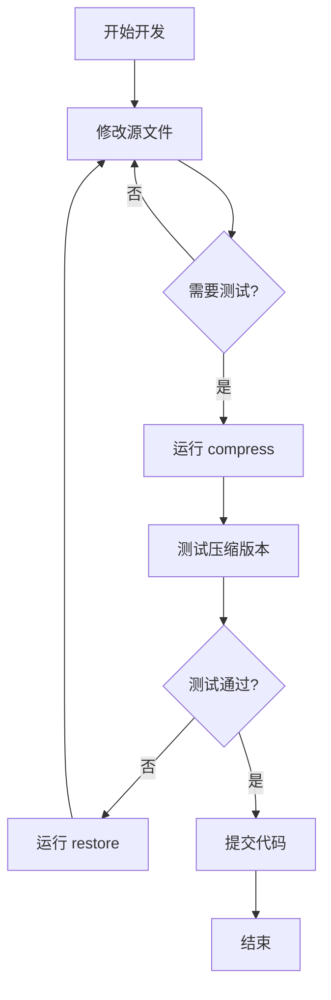

# Mosdns 前端资源优化指南

## 📋 目录

- [快速开始](#快速开始)
- [环境准备](#环境准备)
- [使用说明](#使用说明)
- [工作流程](#工作流程)
- [常见问题](#常见问题)
- [技术细节](#技术细节)

---

## 🚀 快速开始

### 一键压缩资源

```bash
# 压缩所有资源文件（JS、CSS、HTML）
python optimize.py compress
```

### 查看当前状态

```bash
# 查看资源文件状态
python optimize.py status
```

### 恢复开发模式

```bash
# 删除压缩文件，恢复到开发模式
python optimize.py restore
```

---

## 🔧 环境准备

### 必需工具

在使用优化脚本前，需要安装以下工具：

#### 1. Node.js 工具（用于 JS 和 HTML 压缩）

```bash
# 全局安装 Terser（JavaScript 压缩）
npm install -g terser

# 全局安装 html-minifier-terser（HTML 压缩）
npm install -g html-minifier-terser
```

#### 2. Python 3.x

确保已安装 Python 3.x（脚本使用 Python 编写）

```bash
# 检查 Python 版本
python --version
```

### 验证安装

```bash
# 验证 Terser
terser --version

# 验证 html-minifier-terser
html-minifier-terser --version

# 验证 Python
python --version
```

---

## 📖 使用说明

### 命令列表

| 命令 | 说明 | 示例 |
|------|------|------|
| `compress` | 压缩所有资源文件 | `python optimize.py compress` |
| `restore` | 恢复到开发模式 | `python optimize.py restore` |
| `status` | 显示资源文件状态 | `python optimize.py status` |
| `help` | 显示帮助信息 | `python optimize.py help` |

### 详细说明

#### 1. 压缩资源 (`compress`)

**作用**：

- 压缩 `log.js` → `log.min.js`（使用 Terser）
- 合并 4 个 CSS 文件 → `bundle.css`
- 压缩 `bundle.css` → `bundle.min.css`
- 压缩 `log.html` → `log.min.html`

**使用场景**：

- 准备发布新版本前
- 需要测试优化效果时
- 构建生产环境包时

**示例输出**：

```
============================================================
  开始压缩资源文件
============================================================

→ 步骤 1/3: 压缩 JavaScript...
✓ JavaScript 压缩完成: 216,163 → 123,863 bytes (42.7% 减少)

→ 步骤 2/3: 合并并压缩 CSS...
→   已合并: log_refactored.css
→   已合并: enhancements.css
→   已合并: performance.css
→   已合并: ui-enhancements.css
✓ CSS 压缩完成: 98,786 → 68,474 bytes (30.7% 减少)

→ 步骤 3/3: 压缩 HTML...
✓ HTML 压缩完成: 72,442 → 41,253 bytes (43.1% 减少)

============================================================
  压缩完成！
============================================================
```

#### 2. 恢复开发模式 (`restore`)

**作用**：

- 删除所有压缩文件
- 恢复到开发状态

**使用场景**：

- 需要修改源代码时
- 调试问题时
- 开发新功能时

**注意**：

- 此操作会删除压缩文件，需要确认
- 恢复后需要手动修改 HTML 引用（如果需要）

#### 3. 查看状态 (`status`)

**作用**：

- 显示所有资源文件的存在状态和大小
- 快速了解当前是压缩模式还是开发模式

**示例输出**：

```
============================================================
  资源文件状态
============================================================

压缩文件状态:
✓ JavaScript (压缩): 存在 (123,863 bytes)
✓ CSS (合并): 存在 (98,902 bytes)
✓ CSS (压缩): 存在 (68,474 bytes)
✓ HTML (压缩): 存在 (41,253 bytes)

原始文件:
✓ JavaScript: 存在 (216,163 bytes)
✓ HTML: 存在 (72,442 bytes)

CSS 源文件:
✓ log_refactored.css: 存在 (85,348 bytes)
✓ enhancements.css: 存在 (8,160 bytes)
✓ performance.css: 存在 (1,772 bytes)
✓ ui-enhancements.css: 存在 (3,506 bytes)
```

---

## 🔄 工作流程

### 开发流程



### 典型场景

#### 场景 1: 开发新功能

```bash
# 1. 确保在开发模式
python optimize.py status

# 2. 如果有压缩文件，先恢复
python optimize.py restore

# 3. 修改源文件
# 编辑 coremain/www/assets/js/log.js
# 编辑 coremain/www/assets/css/*.css

# 4. 测试修改
# 启动 mosdns 服务并测试

# 5. 准备发布前压缩
python optimize.py compress

# 6. 测试压缩版本
# 重启服务，验证功能正常

# 7. 提交代码
git add .
git commit -m "feat: 添加新功能"
```

#### 场景 2: 修复 Bug

```bash
# 1. 恢复开发模式
python optimize.py restore

# 2. 修改源文件并测试
# 修复 bug...

# 3. 验证修复后重新压缩
python optimize.py compress

# 4. 提交
git add .
git commit -m "fix: 修复某个问题"
```

#### 场景 3: 发布新版本

```bash
# 1. 确保所有源文件已更新
git pull origin main

# 2. 压缩资源
python optimize.py compress

# 3. 查看压缩效果
python optimize.py status

# 4. 编译二进制
# Linux amd64
$env:GOOS='linux'; $env:GOARCH='amd64'; go build -ldflags="-s -w" -o release/mosdns .

# 5. 测试
# 部署到测试环境验证

# 6. 打包发布
# 创建 release...
```

---

## ❓ 常见问题

### Q1: 压缩后功能异常怎么办？

**A**:

1. 运行 `python optimize.py restore` 恢复开发模式
2. 检查源文件是否有语法错误
3. 修复后重新运行 `python optimize.py compress`
4. 如果问题持续，检查压缩工具版本

### Q2: 如何只压缩某个文件？

**A**:
脚本设计为全量压缩。如需单独压缩，可以手动运行：

```bash
# 仅压缩 JavaScript
terser coremain/www/assets/js/log.js --compress --mangle -o coremain/www/assets/js/log.min.js

# 仅压缩 HTML
html-minifier-terser --collapse-whitespace --remove-comments -o coremain/www/log.min.html coremain/www/log.html
```

### Q3: 压缩后文件大小没有明显减少？

**A**:

- JavaScript 应该减少 40-45%
- CSS 应该减少 25-35%
- HTML 应该减少 40-45%

如果减少幅度不符合预期：

1. 检查源文件是否已经是压缩版本
2. 确认压缩工具正确安装
3. 运行 `python optimize.py status` 查看文件大小

### Q4: 如何在 HTML 中切换压缩/未压缩版本？

**A**:
编辑 `coremain/www/log.html`：

**使用压缩版本**（生产环境）：

```html
<link rel="stylesheet" href="assets/css/bundle.min.css">
<script src="assets/js/log.min.js" defer></script>
```

**使用未压缩版本**（开发环境）：

```html
<link rel="stylesheet" href="assets/css/log_refactored.css">
<link rel="stylesheet" href="assets/css/enhancements.css">
<link rel="stylesheet" href="assets/css/performance.css">
<link rel="stylesheet" href="assets/css/ui-enhancements.css">
<script src="assets/js/log.js" defer></script>
```

### Q5: 团队协作时如何处理压缩文件？

**A**:
**推荐做法**：

- ✅ 将压缩文件提交到 Git（便于直接部署）
- ✅ 在 PR 中说明是否包含压缩文件更新
- ✅ 发布前统一运行一次 `compress` 确保最新

**可选做法**：

- 将压缩文件加入 `.gitignore`
- 在 CI/CD 中自动运行压缩脚本

---

## 🔬 技术细节

### 压缩原理

#### JavaScript 压缩（Terser）

- **变量名混淆**：将长变量名替换为短变量名（a, b, c...）
- **死代码消除**：移除永远不会执行的代码
- **表达式简化**：优化逻辑表达式
- **空白移除**：移除所有不必要的空格和换行

**示例**：

```javascript
// 压缩前
function calculateTotal(price, quantity) {
    const total = price * quantity;
    return total;
}

// 压缩后
function calculateTotal(a,b){return a*b}
```

#### CSS 压缩（正则表达式）

- **注释移除**：删除所有 `/* ... */` 注释
- **空白压缩**：将多个空格压缩为一个
- **格式优化**：移除 `{` `}` `:` `;` 周围的空格
- **冗余移除**：删除 `}` 前的最后一个 `;`

**示例**：

```css
/* 压缩前 */
.button {
    background-color: blue;
    padding: 10px;
}

/* 压缩后 */
.button{background-color:blue;padding:10px}
```

#### HTML 压缩（html-minifier-terser）

- **空白折叠**：将多个空格/换行压缩为一个
- **注释移除**：删除 HTML 注释
- **属性优化**：移除冗余属性
- **内联压缩**：压缩内联的 CSS 和 JS

### 文件结构

```
mosdns_project/
├── coremain/
│   └── www/
│       ├── assets/
│       │   ├── css/
│       │   │   ├── log_refactored.css      # 源文件
│       │   │   ├── enhancements.css        # 源文件
│       │   │   ├── performance.css         # 源文件
│       │   │   ├── ui-enhancements.css     # 源文件
│       │   │   ├── bundle.css              # 合并文件
│       │   │   └── bundle.min.css          # 压缩文件 ✨
│       │   └── js/
│       │       ├── log.js                  # 源文件
│       │       ├── log.min.js              # 压缩文件 ✨
│       │       └── log.min.js.map          # Source Map
│       ├── log.html                        # 源文件
│       └── log.min.html                    # 压缩文件 ✨
├── optimize.py                             # 优化脚本 🔧
└── OPTIMIZATION.md                         # 本文档 📖
```

### 优化效果统计

| 文件类型 | 原始大小 | 压缩后大小 | 减少比例 |
|---------|---------|-----------|---------|
| JavaScript | 211.10 KB | 120.96 KB | **42.7%** |
| CSS (合并) | 96.47 KB | 66.87 KB | **30.7%** |
| HTML | 70.74 KB | 40.29 KB | **43.1%** |
| **总计** | **378.31 KB** | **228.12 KB** | **39.7%** |

### 性能提升预期

- **首屏加载时间**：减少 30-40%
- **网络传输时间**：减少 39.7%
- **浏览器解析时间**：提升 20-30%

---

## 📝 更新日志

### v1.0.0 (2025-12-07)

- ✨ 初始版本
- ✅ 支持 JavaScript、CSS、HTML 压缩
- ✅ 支持一键恢复开发模式
- ✅ 支持状态查看
- 📖 完整的使用文档

---

## 🤝 贡献指南

如果您发现问题或有改进建议：

1. 在项目中创建 Issue
2. 描述问题或建议
3. 如果可能，提供解决方案

---

## 📞 联系方式

如有问题，请联系项目维护者或在团队群中讨论。

---

**祝您使用愉快！** 🎉
